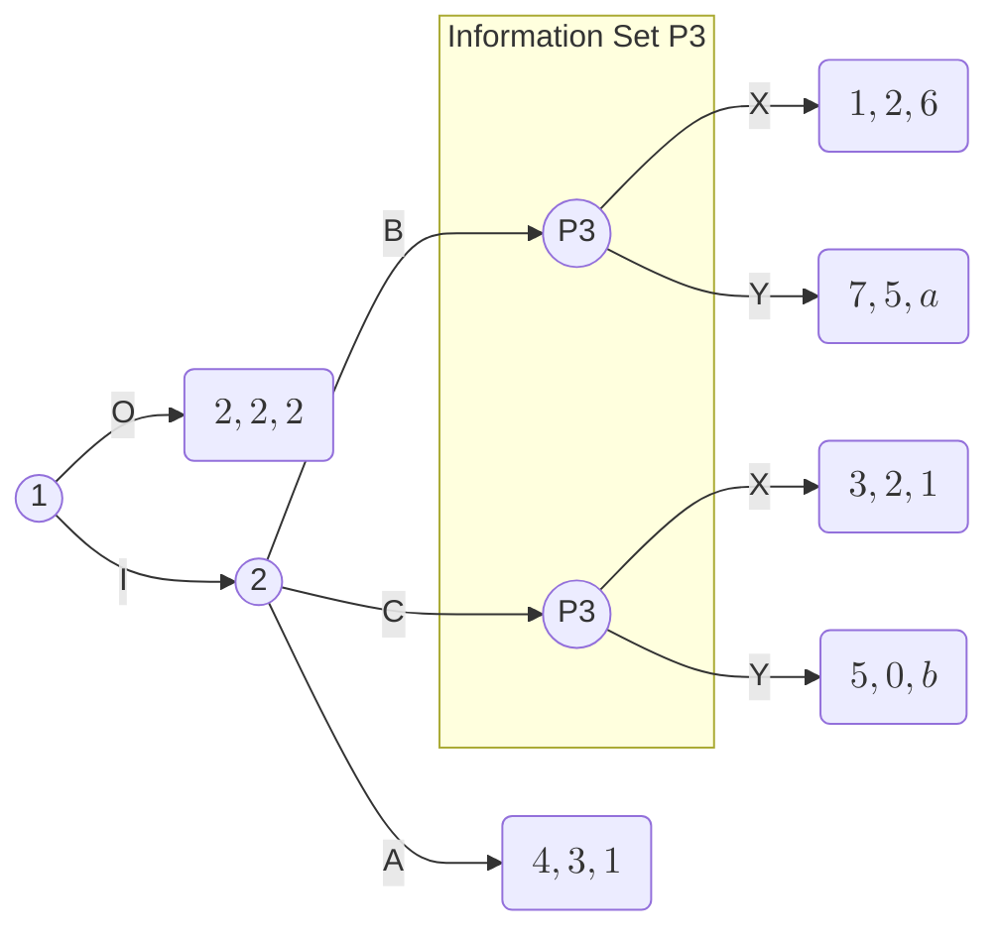

# Prova 2

- **Teoria dos Jogos em Computação**
- **Professor:** Pedro O.S. Vaz de Melo
- 26 de novembro de 2019

- **Nome:**

  - escrevendo o meu nome eu juro que seguirei o código de honra

- **Código de Honra para este exame:**
  - Não darei ajuda a outros colegas durante os exames, nem lhes pedirei ajuda;
  - não copiarei nem deixarei que um colega copie de mim.
- **Escolha 3 questões para fazer:** $\{\}, \{\}, \{\}$
  - Se você escolher todas, as três primeiras serão corrigidas e a última, ignorada.

---

## 1. ($10 points$)

Considere o jogo de dois jogadores abaixo, em que $\theta \in \{0, 3\}$ é um parâmetro conhecido pelo jogador P1. O jogador P2 não tem (nem terá, até a distribuição dos payoffs) nenhuma informação sobre $\theta$, mas acredita que $\theta = 0$ com probabilidade $1/2$ e $\theta = 3$ com probabilidade $1/2$. Todas essas informações são de conhecimento comum.

| X        | $P_2: L$      | $P_2: R$      |
| -------- | ------------- | ------------- |
| $P_1: T$ | $(2, 2)$      | $(0, \theta)$ |
| $P_1: B$ | $(\theta, 0)$ | $(1, 1)$      |

1. (2 pts) Escreva esse jogo (jogadores, ações e tipos) formalmente como um jogo Bayesiano usando a notação de tipos epistêmicos.
2. (8 pts) Compute dois equilíbrios de Nash Bayesianos para esse jogo.

---

## 2. ($10 points$)

Considere que o jogo na forma extensiva representado abaixo. Note que dois _payoffs_ do Jogador 3 não foram especificados: $a$ e $b$. Uma possibilidade é $(5, 0)$, isto é, $a = 5$ e $b = 0$. Outra possibilidade é $(0, 5)$. Para todas as questões abaixo, você deve ater a estratégias puras.

### 2.1. (4 pts) Encontre todos os SPNE (sub-perfect Nash equilibrium) do jogo usando $(a, b) = (5, 0)$

- Backward induction: $(a, b) = (5, 0)$
  - IB: J3
    - (6 x 5)
  - IC: J3
    - (1 x 0)
  - Logo, X domina Y
- P3: X (domina Y)

- I: J2
  - (A, B, C) = (3, 2, 2)
  - A domina B e C
- $\varnothing$: J1
  - (O, I) = (2, 3)
  - I domina O

### 2.2. (6 pts) Encontre todos os SPNE (sub-perfect Nash equilibrium) do jogo usando $(a, b) = (0, 5)$

<!--
| X        | $P_3: \varnothing$ | $P_3: X$ | $P_3: Y$ |
| -------- | :----------------: | :------: | :------: |
| $P_2: A$ |      $(3, 1)$      | $(3, 1)$ | $(3, 1)$ |
| $P_2: B$ |   $\varnothing$    | $(2, 6)$ | $(5, 0)$ |
| $P_2: C$ |   $\varnothing$    | $(2, 1)$ | $(0, 5)$ |
-->

| X        |    $P_3: X$    |  $P_3: Y$  |
| -------- | :------------: | :--------: |
| $P_2: B$ | (**2**, **6**) | (**5**, 0) |
| $P_2: C$ |  (**2**, 1)$   | (0, **5**) |

---

## 3. (10 points)

Duas empresas competidoras, 1 e 2, jogam o seguinte jogo repetido infinito em que todas as jogadas anteriores são observadas, e cada jogador tenta maximizar a soma dos seus lucros com fator de desconto $\beta = 4/5 = 0.8$. A cada estágio $t$, simultaneamente, cada firma $i$ seleciona o preço $\pi \in \{1,2,3,4,5\}$ do seu produto. Se $\pi = p2$, então cada firma vende uma unidade do produto e tem lucro $\pi = p2$. Caso contrário, se $\pi < pj$, a empresa de menor preço vende duas unidades, lucrando $2 \times \pi$, e a de maior preço não vende nenhuma, lucrando 0. Considere que produzir produtos não custa nada para as empresas.

Dicas:

- $\sum_{k=0}^{\infty} x^k = \frac{1}{1-x}$
- $\sum_{k=1}^{\infty} x^k = \frac{x}{1-x}$
- $\sum_{k=0}^{\infty} x^{2k} = \frac{1}{1-x^2}$

### 3.1. (8 pts) Encontre um subgame perfect equilibrium (SPE) que dá aos jogadores um lucro médio (por estágio) de pelo menos 4. Verifique que o perfil de estratégia que você construiu é de fato um SPE

### 3.2. (2 pts) Considerando o seu perfil de estratégia, que efeito a mudança do fator de desconto $\beta$ para $3/5 = 0.6$ produziria? Ainda seria um equilíbrio?

---

## 4. (10 points) Considere o jogo na forma normal abaixo

| X          | $P_2: y_1$ | $P_2: y_2$ | $P_2: y_3$ |
| ---------- | ---------- | ---------- | ---------- |
| $P_1: x_1$ | 0, 0       | 4, 3       | 2, 4       |
| $P_1: x_2$ | 1, 4       | 2, 0       | 0, 0       |

### 4.1. (2 pts) Escreva o sistema de equações do algoritmo Lemke Howson

$$
\begin{cases}
  r_{x_1} = 1 - \sout{0 p_{y_1}} - 4 p_{y_2} - 2 p_{y_3} \\
  r_{x_2} = 1 - 1 p_{y_1} - 2 p_{y_2} - \sout{0 p_{y_3}} \\
  s_{y_1} = 1 - \sout{0 p_{x_1}} - 4 p_{x_2} \\
  s_{y_2} = 1 - 3 p_{x_1} - \sout{0 p_{x_2}} \\
  s_{y_3} = 1 - 4 p_{x_1} - \sout{0 p_{x_2}} \\
\end{cases}
$$

### 4.2. (3 pts) Execute **duas** trocas de base a partir do algoritmo Lemke Howson. Inicie colocando $x_1$ na base

$$
\begin{cases}
  r_{x_1} = 1 - 0 p_{y_1} - 4 p_{y_2} - 2 p_{y_3} \\
  r_{x_2} = 1 - 1 p_{y_1} - 2 p_{y_2} - 0 p_{y_3} \\
  s_{y_1} = 1 - 0 p_{x_1} - 4 p_{x_2} \\
  s_{y_2} = 1 - 3 p_{x_1} - 0 p_{x_2} \\
  s_{y_3} = 1 - 4 p_{x_1} - 0 p_{x_2} \\
\end{cases}
$$

$$
\begin{cases}
  r_{x_1} = 1 - 4 p_{y_2} - 2 p_{y_3} \\
  r_{x_2} = 1 - 1 p_{y_1} - 2 p_{y_2} \\
  s_{y_1} = 1 - 4 p_{x_2} \\
  s_{y_2} = 1 - 3 p_{x_1} \\
  s_{y_3} = 1 - 4 p_{x_1} \\
\end{cases}
$$

- MRT($x_1$):

  - $y_2: -3/1 = -3$
  - $y_3: -4/1 = -4$ Menor = sai

- $s_{y_3} = 1 - 4 p_{x_1}$
- $- 4 p_{x_1} = 1 + s_{y_3}$
- $p_{x_1} = \frac{1}{-4}(1 + s_{y_3})$

Atualizando as outras equações:

- $s_{y_2} = 1 - 3 p_{x_1}$
- $s_{y_2} = 1 - 3 \left(\frac{1}{-4}(1 + s_{y_3})\right)$
- $s_{y_2} = 1 + \frac{3}{4}(1 + s_{y_3})$
- $s_{y_2} = \frac{4}{4} + \frac{3}{4} + \frac{3}{4}s_{y_3}$
- $s_{y_2} = \frac{7}{4} + \frac{3}{4}s_{y_3}$

$$
\begin{cases}
  r_{x_1} = 1 - 4 p_{y_2} - 2 p_{y_3} \\
  r_{x_2} = 1 - 1 p_{y_1} - 2 p_{y_2} \\
  s_{y_1} = 1 - 4 p_{x_2} \\
  s_{y_2} = \frac{7}{4} + \frac{3}{4}s_{y_3} \\
  p_{x_1} = \frac{1}{-4} - \frac{1}{4}s_{y_3} \\
\end{cases}
$$

### 4.3. (1 pt) As duas trocas anteriores encontraram um equilíbrio de Nash? Caso afirmativo, qual?

### 4.4. (3 pts) De onde parou, execute mais duas trocas de base usando o algoritmo Lemke Howson. Se não estiver claro qual variável deverá entrar na base, inicie colocando x2 na base

### 4.5. (1 pt) As duas trocas anteriores encontraram um equilíbrio de Nash? Caso afirmativo, qual?
